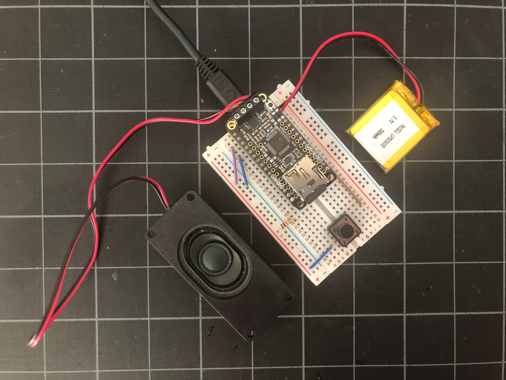

# Wildwood 2017

This is a video of a project we made in [Wildwood, NJ](https://goo.gl/maps/p3Lnm2UP7CT2) in the summer or 2017.

The goals of the project were to have some fun while on vacation and to learn about the [Adafruit Feather HUZZAH with ESP8266](https://www.adafruit.com/product/3213).

If you've ever been to Wildwood, NJ, you'll surely recognize the sound of _"Watch the tram car please!"_ when you press the button.

You can see a video of the project in action on YouTube:

* [https://youtu.be/C7_i-FtaPmg](https://youtu.be/C7_i-FtaPmg)

#### Author

[@jefforulez](https://github.com/jefforulez)
